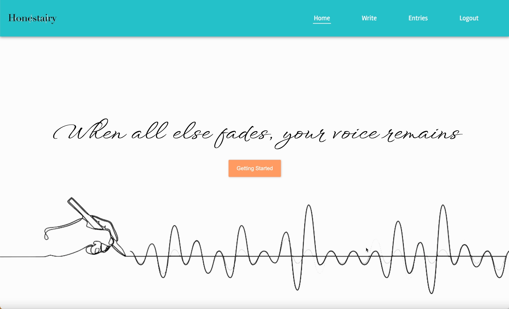

## 🗣 Honestiary

음성으로 일기장을 작성하여 텍스트 감정 분석을 통해 그래프로 한 눈에 확인할 수 있는 **Web Application**입니다.

<br/>
<br/>

## 💡 Motivation

- 미래만을 바라보며 바쁘게 살다보면 내가 어떤 사람이었는지 잊을 때가 있습니다. 내가 **언제 기뻐했고 언제 슬퍼했고 무엇을 좋아했고 무엇을 싫어했는지** 기억이 안날 때가 있습니다.

- **글은 언제나 자기가 원한다면 Ctrl + Z로 되돌릴 수 있습니다.** 그래서 자신을 속이기 쉽죠. **음성은 그렇지 않습니다.** 음성으로 일기를 남길 수 있고 음성으로 남겨진 일기들의 텍스트가 분석될 수 있다면 조금 더 진실된 일기장을 작성할 수 있지 않을까? 에서 출발하여 Honest + Diary 의 합성어인 **Honestiary**가 탄생하였습니다.

<br/>
<br/>

## 소개



<br/>
<br/>

## ⭐️ Features

- **다이어리 작성**

  - 음성 녹음으로 일기장을 작성할 수 있습니다.
  - 음성은 텍스트로 변환이 됩니다.
  - 음성 및 변환된 텍스트는 감성 분석 결과과 함께 저장이 됩니다.
  - Effect Mode는 현재 음성의 주파수에 따라 시각화를 시켜주는 모드입니다.
  - Script Mode는 변환되고 있는 텍스트를 확인할 수 있는 모드입니다.

- **다이어리 리스트 보기**

  - 날짜 범위와 감성 분석 스코어 검색 옵션을 선택하여 존재하는 일기장 리스트를 확인할 수 있습니다.
  - 감성 분석 점수에 따라서 이모티콘의 모습이 달라집니다.
  - X 버튼을 클릭하면 삭제가 가능합니다.

- **다이어리 그래프 보기**

  - 일기장의 날짜와 감성 분석 결과를 축으로 하는 그래프를 확인할 수 있습니다.
  - 각 일기장은 원으로 표시됩나다.
  - 점수가 높을 경우 색상이 초록색에 가까워지고 높이가 올라갑니다.
  - 점수가 낮은 경우 색상이 파란색에 가까워지고 높이가 낮아집니다.
  - 원으로 그려진 일기장을 클릭하면 녹음을 듣고 읽을 수 있습니다.

  <br/>
  <br/>

## 🔗 Table of Contents

**[📆 프로젝트 기간](#-프로젝트-기간)**

**[📦 기술 스택](#-기술-스택)**

**[🔧 Usage](#-usage)**

**[💽 Deploy](#-deploy)**

**[🔥 Tech Talk](#-tech-talk)**

**[🏁 프로젝트를 마친 소감](#-프로젝트를-마친-소감)**

<br/>
<br/>

## 📆 프로젝트 기간

### 2023.02 21 ~ 2023.03.13 (3 Weeks)

**Week 1: Planning**

- 아이디어 기획 및 기술 스택 선정
- 목업 디자인 (Figma)
- 데이터베이스 스키마 모델링 (Lucid Chart)
- 칸반 태스크 작성 (Notion)

<br/>

**Week 2: Development**

- 로그인 기능 구현
- 다이어리 작성 페이지 구현
  - Web Audio API
  - Web Speech API
  - Canvas
- 다이어리 목록 페이지 구현

**Week 3: Development**

<br/>

- 다이어리 그래프 페이지 구현
  - d3.js
- 다이어리 상세 페이지 구현
- 리팩토링
- 테스트 코드
- 배포

<br/>
<br/>

## 📦 기술 스택

**Client**

- React
- React-router-dom
- Redux-toolkit
- Styled-components
- Web Audio API
- Web Speech API
- D3.js
- Firebase

<br/>

**Server**

- Node.js
- Express.js
- MongoDB & Mongoose
- AWS S3 & Multer
- JSON Web Token

<br/>
<br/>

## 🔧 Usage

- 데스크탑 크롬 웹 브라우저 환경에서 실행을 권장합니다.
- 영문 사용자를 위한 어플리케이션임을 참고해주세요.

**Client**

- 클라이언트 프로젝트를 다운받은 후 .env 파일을 생성하여, 다음과 같이 환경 변수를 설정해주세요.

```
REACT_APP_SERVER_URL=<SERVER_URL>
REACT_APP_FIREBASE_API_KEY=<API_KEY>
REACT_APP_FIREBASE_AUTH_DOMAIN=<AUTH_DOMAIN)
REACT_APP_FIREBASE_PROJECT_ID=<PROJECT_ID>
REACT_APP_FIREBASE_STORAGEBUCKET=<STORAGE_BUCEKT>
REACT_APP_FIREBASE_MESSAGING_SENDER_ID=<MESSAGIN_SENDER_ID>
REACT_APP_FIREBASE_APP_ID=<APP_ID>
REACT_APP_FIREBASE_MEASUREMENT_ID=<MEASUREMENT_ID>
```

<br/>

**Server**

- 서버 프로젝트를 다운받은 후 .env 파일을 생성하여, 다음과 같이 환경 변수를 설정해주세요.

```
PORT=<YOUR_PORT>
CLIENT_URL=<YOUR_CLIENT_URL>
MONGO_DB_URL=<YOUR_MONGO_DB_URL>
ACCESS_TOKEN_SECRET=<SECRET_TOKEN>
AWS_S3_ACCESS_KEY_ID=<ACCESS_KEY_ID>
AWS_S3_SECRET_ACCESS_KEY<SECRET_ACCESS_KEY>
AWS_S3_BUCKET_NAME=<BUCKET_NAME>
```

<br/>
<br/>

## 💽 Deploy

- Netlify를 이용한 어플리케이션 자동화 배포
- AWS Elastic Beanstalk를 이용한 어플리케이션 배포

<br/>
<br/>

## 🔥 Tech Talk

### Importance of Global State Management

- 초기 다이어리를 리스트를 검색 할 때는 리덕스를 사용하지 않고 부모 컴포넌트에서 내려주도록 했었습니다. 그러자, 리스트에서 날짜를 선택하고 검색을 한 후에 다른 페이지로 이동하면 이미 Unmount가 되어 기존 검색 옵션들이 초기화가 되는 현상이 발생하였습니다. 사용자 입장에서는 분명히 이전에 설정한 검색 옵션을 유지하고 싶을 것이라고 기대를 할 것 입니다. 이를 해결하기 위해서 검색 옵션을 전역 상태로 관리를 하여 새로고침을 하지 않는 이상 유지되도록 하여 사용자의 경험을 향상 시킬 수 있었습니다.

- 전역 상태로 관리를 할 때 한 가지 문제점이 발생했었는데 새로고침을 하거나 다시 브라우저를 닫았다가 들어와도 검색 옵션들이 계속 유지되는 것이었습니다. 디버깅을 해본 결과 로그인을 유지하기 위해서 Redux-persist를 사용하고 있었는데 이 검색 옵션도 Redux로 인하여 전역으로 관리되고 있어 새로 고침을 하여도 유지가 되었던 것입니다. redux-persist의 blacklist에 옵션에 추가하여 해결할 수 있었습니다.

<br/>

### Custom Hooks and Separation of Concerns

- 개인 프로젝트를 처음 진행하면서 로직이 길어지고 앱이 복잡해지는 현상이 발생하였습니다. 특히, 다이어리를 작성하는 페이지에서 녹음을 하는 로직, 음성을 시각화 시켜주는 로직, 음성을 텍스트로 변환해주는 로직이 한 곳에서 필요했는데 CSS 로직을 제외하고 300줄 이상이 되었습니다. 코드도 서로 섞여있어 가독성에도 좋지 않았죠. 듣기만 했던 스파게티 코드가 이것이구나! 라는걸 깨닫게 되는 순간이었습니다. 이렇다보니 작은 수정을 할 때도 관련 로직을 찾기가 어려웠죠.

- FEConf에서도 관심사의 분리가 자주 언급 되었던 기억이 납니다. 멘토님에게도 자주 들었던 이야기였죠. 커스텀 훅은 관심사를 분리하는데 최적이라고 생각을 하고 로직을 분리를 하기 시작 하였습니다. **음성 녹음 로직(useVoiceRecording), 음성 시각화 로직(useVoiceVisuazliation), 음성 텍스트 변화 로직(useSpeechRecognition) 세 가지 커스텀 훅으로 분리를 하였습니다. 다이어리 작성 페이지에 300줄이상 이었던 코드는 100줄로 줄어들고 추후에 디버깅이나 수정사항이 있을때 해당하는 커스텀 훅만 확인하면 되어서 정말 편리했었습니다.**

<br/>

### Speech To Text (STT)

- STT는 음성을 텍스트로 변환하는 기술입니다. 기획 단계에서 고민한 점들을 작성하려고 합니다. 처음 이 기술을 알아보면서 여러가지 방법이 있다는 것을 알게되었습니다. 크게 2가지로 나눌 수 있는데요. 첫 번째는 마이크 인풋 -> 텍스트 변환, 두 번째는 음성 파일 -> 텍스트 변환입니다.

- 두 가지 기술 중에서 굉장히 고민을 많이했었습니다. 선택은 첫 번째 마이크 인풋 -> 텍스트 변환을 결정하였습니다. 그 이유는 사용자가 일기를 작성하고 있는 느낌이 필요했기 때문입니다. 현재 말하고 있는 마이크 음성이 다이어리에 한 글자, 두 글자씩 적어가면서 사용자가 적어가고 있다는 경험을 주고 싶었습니다. 뿐만 아니라 음성 파일 -> 텍스트 변환의 경우는 여러 명이서 대화를 하거나 강의와 같은 영상에 적합하다고 생각하였습니다. 혼자서 일기를 작성하는 앱에서는 마이크 인풋 -> 텍스트 변환이 최적이라고 생각하여 이 기술을 선택하게 되었습니다.

<br/>

### D3.js

- 기획을 할 당시에는 다이어리들의 점수와 날짜를 기준으로 그래프화하여 표시하기 위해서 어떠한 라이브러리가 있었는지 찾아보아습니다. chart.js와 d3.js가 가장 많이 쓰인다는 것을 알게되었습니다. 단지 그래프를 그리기 위해서는 chart.js 러닝커브가 낮고 사용하기 쉽다는 것을 알게되었지만 커스텀하여 사용하기에는 적합하지 않다고 생각이 들었습니다. 그래서 그래프화를 하는데 d3.js 라이브러리를 선택하게 되었습니다.

- SVG자체를 다뤄 본적이 없었고 d3.js의 scale, domain, range등 기본 개념도 낯설었습니다. 개념을 학습하는 것도 중요하지만 직접 눈으로 보고 조작해가면서 배우는 것이 가장 빠른 방법이라고 생각하기 때문에 공식 문서 예제들을 참고하고 직접 만들어보고 조작하며 개념도 함께 학습하였습니다. 그 결과 학습 시간을 단축 시킬 수 있었습니다.

- 코드를 작성하면서 문제가 하나 있었는데, 날짜를 X축을 기준으로 하면서 발생한 문제중 하나는 검색 옵션중 날짜 범위가 늘어날 때 Width가 이에 맞춰 늘어나지 않는다는 점이었습니다. 이렇게 되면 점수를 나타내고 있는 원들의 크기가 작아지고 날짜도 읽기도 어렵게 됩니다. 어떻게 해결하면 좋을지 고민을 하고 검색을 해본 결과 Zoom 이벤트를 사용하고 날짜의 제한을 두어 해결을 할 수 있었습니다.

<br/>
<br/>

## 🏁 프로젝트를 마친 소감

- 개인 프로젝트를 하면서 모든 것을 혼자 결정을 하니 많이 힘들었던 것 같습니다. 팀 프로젝트에서 같이 고민을 하던 문제들을 혼자 생각을 하니 관점의 전환이 쉽지 않았던 게 어려웠던 것 같습니다.

- 감성 분석을 위해 텐서플로우 라이브러리를 이용한 머신러닝 기술을 프로젝트에 사용해보지 못한 점이 아쉽습니다. 텍스트에 대하여 감성 분석을 어떻게 하면 좋을지에 대해서 기획하는 7일중 3일동안 고민을 했었습니다. 텍스트 분류와 관련하여 리서치를 한 결과 7가지 감정을 나누는 데이터셋을 이용하여 모델을 훈련 시키면 텍스트의 7가지 감정을 분류를 할 수 있었습니다. 하지만, 정확도가 10%조차 되지 않아서 이 방법은 선택지에 없었습니다. 다른 대안으로는 텍스트를 긍정 혹은 부정이라는 2가지로 분류하는 방법이 있었는데 정확도는 90%이상으로 가장 높았지만 그래프화를 시켰을 때 매력적으로 다가오지 않았습니다. 그래서 AFINN Lexicon이라는 사전 단어 기반 점수화 맵핑 되어있는 sentiment라는 라이브러리를 선택하게 되었습니다. 그럼에도, 리서치 과정에서 머신러닝이라는 기술에 대해서 접할 수 있엇 정말 좋은 경험이 되었습니다.

- 기능 개발을 하면서 중간 중간 리팩토링을 동시에 하며 기능을 개발했으면 조금 더 관심사를 분리하고 응집도가 높은 코드를 작성할 수 있지 않았을까? 하는 아쉬움도 남습니다. 애자일 스프린트 방식으로 짧은 시간내에 기능을 구현을 해야하니 기능 개발에 초점을 맞추어 심리적으로 여유가 없었던 것 같습니다. 마지막에 기능 개발을 마치고나서 리팩토링을 진행 하려니 쉽지 않았습니다. 다음에 프로젝트를 진행할 때는 기능 개발과 리팩토링을 적절히 섞어서 가독성도 더 높이고 관심사 분리가 잘 되어 누가 봐도 의도를 알 수 있는 코드를 작성하고 싶습니다.

- 바닐라코딩은 제 인생의 큰 전환점이 되었던 것 같습니다. 스스로 생각하고 학습하는 방법을 배울 수 있었고 이제는 새로운 라이브러리를 사용하는데 겁을 먹지 않게 되었고, 에러가 발생했을 때도 어떻게 접근해야할 지도 잘 알게되었습니다. 이를 바탕으로 앞으로도 꾸준히 노력하여 사용자에게 항상 좋은 경험을 줄 수있는 개발자가 되도록 하겠습니다.

- 단지 요령을 알려주는게 아니라 스스로 걸음마를 뗄 수 있도록 도와주신 멘토님들, 동기분들, 켄님께 감사의 말씀을 전합니다.
