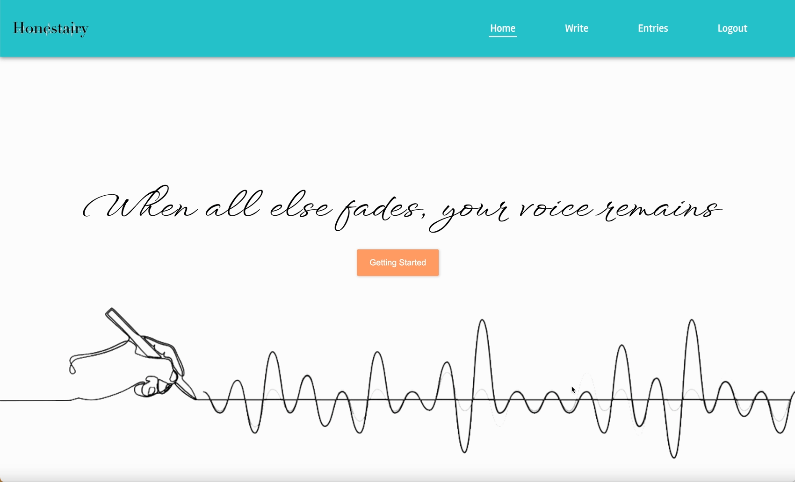

## 🗣 Honestiary: Voice-Driven Sentiment Analysis Diary

**Honestiary** is a **Full-Stack Web Application** designed for voice-based journaling. It converts speech to text, performs sentiment analysis on the transcribed content, and visualizes the user's emotional trends over time using interactive graphs.

<br/>
<br/>

## 💡 Motivation

*   In the rush of focusing solely on the future, it is easy to lose sight of one's emotional history—*what truly brought **joy**, **sadness**, or **passion**.* We often forget the specifics of our own emotional journey.

*   Traditional text-based diaries allow for easy **self-censorship and revision (Ctrl + Z)**, often masking true feelings. **Voice, however, is unfiltered and immediate.** This project started with the hypothesis: Could a voice-based diary, combined with sentiment analysis, lead to a more honest and authentic self-reflection? This concept led to the creation of **Honestiary** (Honest + Diary).

<br/>
<br/>

## Introduction



<br/>
<br/>

## ⭐️ Features

### **Diary Creation**

*   **Voice Recording:** Users can create journal entries through voice recording.
*   **Real-time STT:** The recorded voice is immediately converted into text using Speech-to-Text (STT) technology.
*   **Data Storage:** The audio file and the converted text are stored alongside their corresponding sentiment analysis score.
*   **Effect Mode:** Visualizes the current voice frequency in real-time.
*   **Script Mode:** Displays the text as it is being transcribed.

### **Diary List View**

*   **Advanced Filtering:** Users can filter and search their journal list by date range and sentiment analysis score.
*   **Dynamic Emojis:** Emojis dynamically change based on the sentiment score, providing a quick visual representation of the entry's mood.
*   **Entry Management:** Entries can be easily deleted using the 'X' button.

### **Diary Graph View (Data Visualization)**

*   **Trend Visualization:** Displays emotional trends over time, mapping the Date (X-axis) against the Sentiment Analysis Score (Y-axis).
*   **Interactive Nodes:** Each diary entry is represented as an interactive circular node.
    *   **High Scores:** Closer to green color and positioned higher on the Y-axis.
    *   **Low Scores:** Closer to blue color and positioned lower on the Y-axis.
*   **Playback Functionality:** Clicking a node loads the corresponding audio playback and text transcript for detailed review.

<br/>
<br/>

## 🔗 Table of Contents

**[📆 Project Duration](#-project-duration)**

**[📦 Technical Stack](#-technical-stack)**

**[🔧 Installation & Usage](#-installation--usage)**

**[💽 Deployment](#-deployment)**

**[🔥 Tech Talk: Architectural Decisions](#-tech-talk-architectural-decisions)**

**[🏁 Project Reflection & Key Takeaways](#-project-reflection--key-takeaways)**

<br/>
<br/>

## 📆 Project Duration

### **2023.02 21 ~ 2023.03.13 (3 Weeks)**

**Week 1: Planning & Architecture**

*   Idea conceptualization and Technical Stack selection.
*   Mockup Design (Figma).
*   Database Schema Modeling (Lucid Chart).
*   Task and Sprint Management (Notion/Kanban).

<br/>

**Week 2: Core Development**

*   Login/Authentication feature implementation.
*   Diary Creation Page development:
    *   Web Audio API for recording.
    *   Web Speech API for Speech-to-Text (STT).
    *   Canvas for audio visualization.
*   Diary List View implementation.

**Week 3: Refinement & Delivery**

*   Data Visualization Page implementation:
    *   Graphing using **D3.js**.
*   Diary Detail View implementation.
*   Refactoring and Code Cleanup.
*   Test Coverage implementation.
*   Deployment setup.

<br/>
<br/>

## 📦 Technical Stack

**Client**

*   React
*   React-router-dom
*   Redux-toolkit
*   Styled-components
*   Web Audio API
*   Web Speech API
*   D3.js
*   Firebase (for Authentication)

<br/>

**Server**

*   Node.js
*   Express.js
*   MongoDB & Mongoose
*   AWS S3 & Multer (for audio file storage)
*   JSON Web Token (JWT)

<br/>
<br/>

## 🔧 Installation & Usage

*   **Recommendation:** Best viewed on a Desktop Chrome web browser environment.
*   **Note:** This application is primarily optimized for **English-language users**.

### **Client Setup**

*   After downloading the client repository, create a `.env` file and set the following environment variables:

```
REACT_APP_SERVER_URL=<SERVER_URL>
REACT_APP_FIREBASE_API_KEY=<API_KEY>
... (rest of the Firebase credentials)
```

### **Server Setup**

*   After downloading the server repository, create a `.env` file and set the following environment variables:

```
PORT=<YOUR_PORT>
CLIENT_URL=<YOUR_CLIENT_URL>
MONGO_DB_URL=<YOUR_MONGO_DB_URL>
ACCESS_TOKEN_SECRET=<SECRET_TOKEN>
AWS_S3_ACCESS_KEY_ID=<ACCESS_KEY_ID>
... (rest of the AWS credentials)
```

<br/>
<br/>

## 💽 Deployment

*   **Client:** Automated continuous deployment using **Netlify**.
*   **Server:** Application deployment managed via **AWS Elastic Beanstalk**.

<br/>
<br/>

## 🔥 Tech Talk: Architectural Decisions

This section details key technical challenges and the decisions made to solve them, highlighting software engineering principles.

### Importance of Global State Management

*   **Problem:** Initially, search options (date range, score) were handled in a local component state. Navigating to another page and returning caused the component to unmount, resulting in the loss of the user's previous search criteria, leading to a poor User Experience (UX).
*   **Solution (Redux):** Implemented **Redux-Toolkit** to manage the search options as global state. This ensured the state persisted across component unmounts and page transitions, significantly enhancing UX.
*   **Debugging (Redux-Persist):** A secondary issue arose where the search options persisted even after a hard browser refresh or session closure (undesired behavior). Debugging revealed that **`redux-persist`** (used to maintain the user's login state) was also preserving the search state.
*   **Resolution:** The specific state keys for the search options were added to the **`blacklist`** configuration of `redux-persist`, resolving the unintended persistence issue.

<br/>

### Custom Hooks and Separation of Concerns (SoC)

*   **Problem:** In the diary creation page, the combined logic for voice recording, audio visualization, and STT resulted in a large, tightly-coupled component (**over 300 lines**). This "spaghetti code" reduced readability and made debugging or minor modifications excessively difficult.
*   **Solution (SRP via Custom Hooks):** Applied the **Single Responsibility Principle (SRP)** by extracting the core functionalities into three distinct **Custom Hooks**:
    1.  `useVoiceRecording` (Handles recording start/stop).
    2.  `useVoiceVisuazliation` (Manages Canvas/audio visualization).
    3.  `useSpeechRecognition` (Controls STT conversion).
*   **Impact:** The main component code was reduced to **under 100 lines**. This dramatically improved **maintainability** and **cohesion**, ensuring future changes could be isolated to the relevant hook.

<br/>

### Speech To Text (STT) Decision Making

*   **Dilemma:** The initial planning faced a choice between two main STT approaches: **1) Real-time Mic Input -> Text** or **2) Audio File -> Text (Batch processing)**.
*   **Decision:** The **Real-time Mic Input -> Text** approach was chosen.
*   **Rationale (UX Focus):** This method provides the user with the immediate, psychological feedback of seeing the diary *being written* in real-time as they speak. This sense of **active journaling** was deemed essential for the personal diary app experience, better aligning with the use case than the batch processing typically suited for multi-speaker or lecture transcription.

<br/>

### D3.js Implementation and Responsiveness

*   **Technology Choice:** **D3.js** was selected over Chart.js.
*   **Rationale (Customization):** While Chart.js offered a lower learning curve, D3.js was chosen for its **unparalleled customization capabilities**, which were necessary to create the specific interactive, coordinate-based graph visualization, despite the steeper learning curve involving SVG, scale, domain, and range concepts.
*   **Learning Approach:** Adopted a rapid, hands-on learning strategy, directly manipulating official documentation examples and referencing code to quickly internalize D3's core concepts.
*   **Challenge (Graph Responsiveness):** A major issue was the fixed `width` of the SVG graph. When the date range filter was expanded, the individual data points became too small and the axis labels unreadable.
*   **Resolution:** The problem was solved by implementing **D3 Zoom Events** and setting appropriate date constraints. This allowed the graph to handle variable data sizes dynamically while maintaining optimal readability and responsiveness.

<br/>
<br/>

## 🏁 Project Reflection & Key Takeaways

*   **Solo vs. Team Project:** Acknowledged the challenge of making every architectural decision alone, noting the difficulty in perspective shifting compared to the benefits of team collaboration.
*   **Pragmatic Approach to Sentiment Analysis:** Extensive research was conducted on using Machine Learning (TensorFlow/custom models) for sentiment classification (e.g., 7 emotions). However, due to the low accuracy of the custom model (sub-10%), a pragmatic decision was made to use the more reliable **AFINN Lexicon (dictionary-based scoring)** via the `sentiment` library. This process was a valuable learning experience in **research, evaluation, and making realistic trade-offs (MVP vs. ideal)**.
*   **Refactoring Strategy:** I recognized that focusing solely on feature development during a short sprint (Agile methodology) led to delayed refactoring. In future projects, I will integrate **simultaneous refactoring and feature development** to ensure a consistent, high level of code quality, better Separation of Concerns, and increased code readability from the outset.
*   **Growth:** This personal project served as a major turning point, fostering the ability to **self-learn, embrace new technologies without hesitation**, and systematically approach debugging errors.

I am committed to continually striving to be a developer who delivers exceptional user experiences.

---
*A grateful thank you to my mentors, peers, and the program staff who provided the tools and guidance to transition my career path.*
